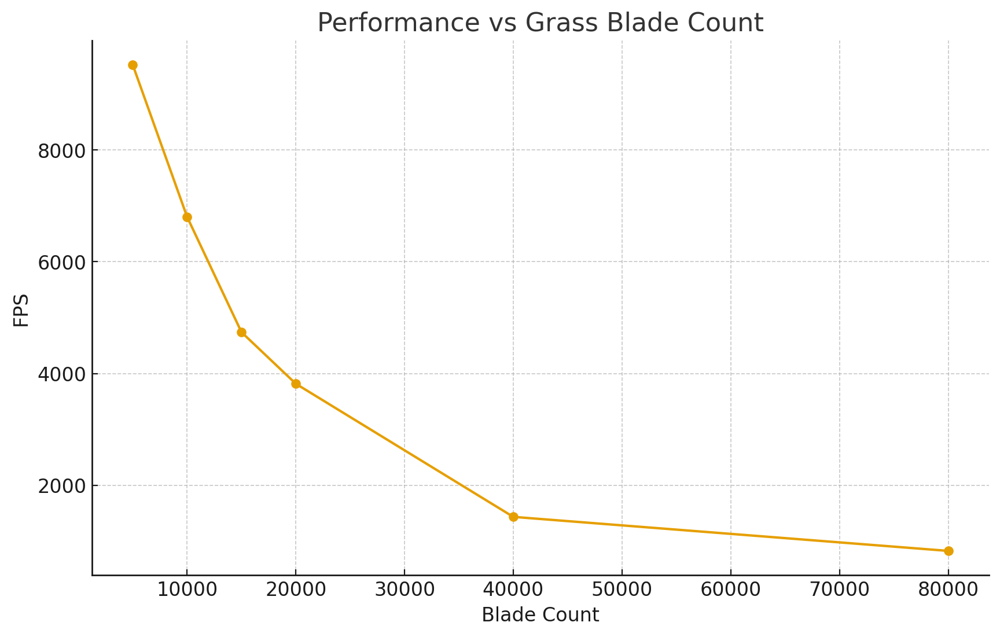

Vulkan Grass Rendering
==================================

**University of Pennsylvania, CIS 565: GPU Programming and Architecture, Project 5**

* Cecilia Chen 
  * [LinkedIn](https://www.linkedin.com/in/yue-chen-643182223/)
* Tested on: Windows 11, i7-13700F @ 2.1GHz 16GB, GeForce GTX 4070 12GB (Personal Computer)

### Demo GIF

## Project Overview

This project implements a real-time Vulkan grass simulator, featuring:
* Grass represented as **Bezier curves**

* Compute shader physics (gravity, wind, recovery forces)

* **Culling**: orientation, frustum, and distance tests

* Distance-aware **LOD** to balance detail and performance

The simulation updates thousands of blades per-frame, while culling prevents unnecessary geometry and shading work.

## Features

### Representing Grass as Bezier curves 

Each Bezier curve has three control points.
* `v0`: the position of the grass blade on the geomtry
* `v1`: a Bezier curve guide that is always "above" `v0` with respect to the grass blade's up vector (explained soon)
* `v2`: a physical guide for which we simulate forces on

 grass blades without any forces on them 

### Physics-Based Forces
Grass blades are simulated as Bezier curves with forces applied on v2, the physical guide point. The compute shader runs every frame and integrates:  
* `Gravity` using environmental and front-gravity components
* `Recovery force` based on stiffness to restore equilibrium
* `Wind` driven by a time-varying directional field with alignment term
* `Constraint correction` to preserve blade length and prevent ground penetration

These continuously animate blades with natural sway and responsiveness.

### Culling

#### Orientation Culling
When the blade’s forward direction is nearly perpendicular to the view vector, it appears edge-on and contributes less than a pixel width. Those are culled to prevent aliasing.

#### View-Frustum Culling
Visibility is evaluated using three Bezier sample points:
* Root **v0**, tip **v2**, and midpoint **m**  

If all fall outside the frustum (with tolerance), the blade is skipped entirely.

#### Distance Culling
As blades move farther from the camera, they shrink below pixel size.
Blades are placed into distance buckets:
* Near buckets: rendered fully
* Far buckets: progressively culled

This removes high-cost geometry that would be visually insignificant.

These combined culling strategies significantly reduce per-frame work while preserving overall scene quality. 

### LOD Tessellation

Grass patches are tessellated with adaptive detail based on camera distance:

* Near: high tessellation for smooth curvature
* Mid: reduced segments to lighten GPU cost
* Far: minimal tessellation or fully culled via distance culling

Dynamic tessellation levels are computed in the tessellation control shader and the tessellation evaluation shader expands patches into world-space grass quads with correct width, height, and bending.

This LOD system keeps nearby grass vivid while keeping the overall triangle count manageable.

## Performance Analysis

### Scaling with Grass Blade Count

The plot below shows how rendering time changes as we increase the number of simulated grass blades. All blades include active physics, culling, and LOD tessellation.

As the number of visible grass blades increases, the GPU experiences a clear and predictable shift in workload dominance. At modest scene density, the compute stage comfortably handles per-blade simulation with minimal impact on total frame time. The pipeline maintains extremely high throughput, indicating that memory bandwidth and parallel math operations still have plenty of headroom.

As density rises further, more blades remain in view after culling and LOD tests. This introduces a larger volume of geometry into the tessellation and raster stages. The overall trend shows the renderer transitioning away from being compute-driven and instead becoming increasingly constrained by fragment processing and screen-space coverage. More of the GPU’s work shifts toward pixel shading and fill-rate, which leads to a steeper decline in frame performance.

### Culling Technique Performance Comparison

This plot compares different culling strategies while keeping the same grass population (50,000) in the scene. Each method reduces GPU workload by removing blades before tessellation and rasterization, but with different effectiveness depending on visibility and camera configuration.

With no culling applied, every blade goes through full simulation, tessellation, and shading, placing a heavy and consistent demand on the GPU. Applying culling changes how much of that work remains:

- Distance culling provides a noticeable improvement by removing detail that the camera cannot resolve, reducing unnecessary geometry load.

- Orientation culling is the most effective in this dataset, since many blades become nearly edge-on to the camera and contribute little to the final image. Eliminating them significantly lightens fragment and tessellation cost.

- View-frustum culling also yields strong gains, though its impact naturally depends on how much of the scene is actually visible inside the camera frustum at a given moment. Scenes with a narrower view or more off-screen geometry benefit more dramatically.

- LOD alone focuses on reducing per-blade complexity rather than removing blades entirely. However, it doesn't really improve the performance here, probably due to the implementation.

Together, these results show a consistent trend:
once blades that will not meaningfully affect the image are removed early in the pipeline, the GPU can redirect its resources toward rendering only what truly matters on screen. The performance boost depends strongly on what the camera can see, but the renderer remains efficient and scalable across varied viewing conditions.